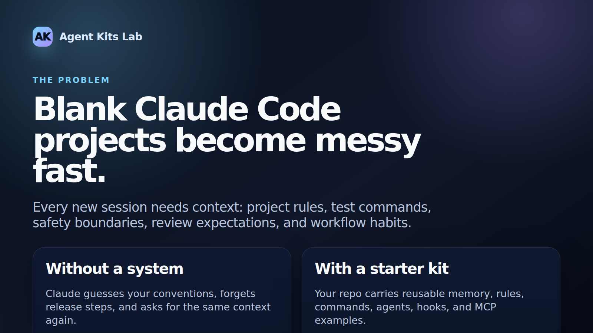
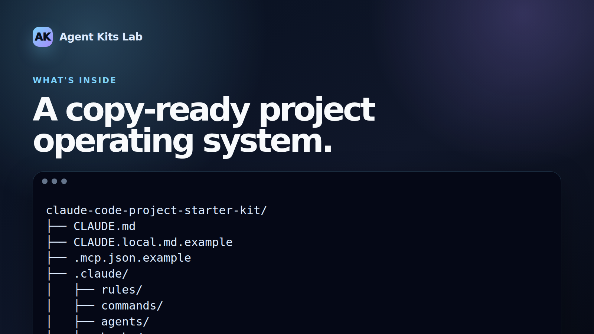
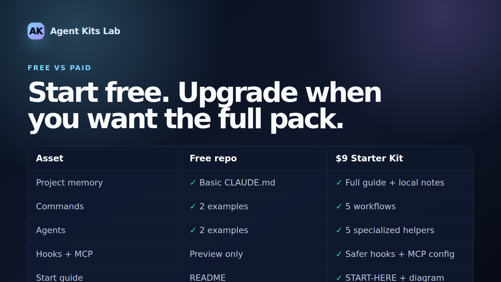
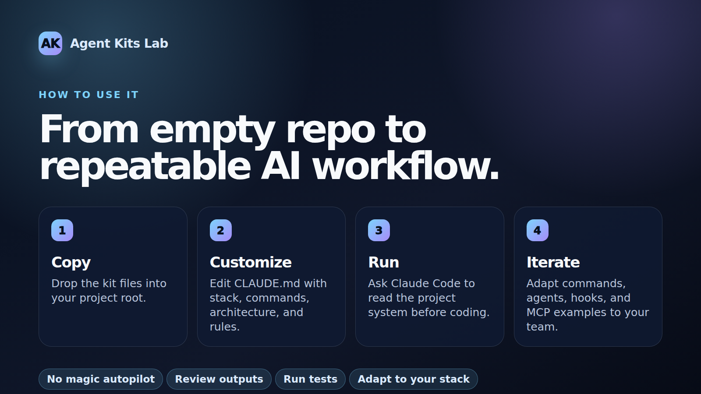

# Claude Code Project Starter Kit — Free Version

A copy-ready free starter template for setting up Claude Code inside a software project.

This repo is a practical baseline for developers who want Claude Code to follow project rules, testing expectations, security boundaries, and repeatable workflows.

> Not affiliated with Anthropic. Claude Code access is not included.



## Why this exists

Claude Code is powerful, but a blank repo often turns every session into the same setup conversation again:

- What is this project?
- Which commands should be used?
- What are the safety boundaries?
- How should tests, reviews, docs, and releases work?

This template gives the project a small operating system: reusable memory, rules, commands, agents, hooks, and MCP examples.

## Choose your path

| If you want... | Use this |
| --- | --- |
| A free baseline to study and customize | This GitHub repo |
| A ready-to-copy pack with more commands, agents, docs, and examples | [Claude Code Project Starter Kit — Starter ($9)](https://ko-fi.com/s/eca2427428) |
| A quick overview before buying | [agentkitslab.com](https://agentkitslab.com) |

The free version is enough to try the pattern. The paid ZIP is for people who want a more complete starting point without assembling every file themselves.

## What is included

```text
.
├── CLAUDE.md
├── CLAUDE.local.md.example
├── .mcp.json.example
└── .claude/
    ├── settings.json
    ├── rules/
    │   ├── api-conventions.md
    │   ├── code-style.md
    │   ├── docs.md
    │   ├── security.md
    │   └── testing.md
    ├── commands/
    │   ├── fix-issue.md
    │   └── review.md
    ├── agents/
    │   ├── code-reviewer.md
    │   └── security-auditor.md
    └── hooks/
        ├── post-edit-reminder.sh
        └── validate-bash.sh
```



## Quick start

```bash
# Copy this template into an existing project
cp -R . /path/to/your-project/
cd /path/to/your-project

# Keep local private notes out of git
cp CLAUDE.local.md.example CLAUDE.local.md

# Optional: copy MCP example and customize locally
cp .mcp.json.example .mcp.json

# Start Claude Code from the project root
claude
```

## Recommended first prompt

```text
Read CLAUDE.md and all files under .claude/. Summarize the project rules, available commands, agents, hooks, and safety boundaries before making changes.
```

## Free template vs. $9 Starter Kit

| Asset | Free GitHub template | $9 Starter Kit |
| --- | --- | --- |
| Project memory | Basic `CLAUDE.md` | Full operating guide plus local notes template |
| Rules | Core examples | Modular rules for style, testing, API, security, and docs |
| Commands | 2 examples | 5 repeatable workflows for review, planning, fixes, docs, release |
| Agents | 2 examples | 5 specialized reviewers and QA helpers |
| Hooks + MCP | Preview examples | Safer bash hooks, post-edit reminders, MCP config example |
| Start guide | README | `START-HERE.md`, product README, structure diagram |



## FAQ

Common questions about safety, customization, commercial use, and the paid Starter ZIP are covered here:

- [FAQ](docs/faq.md)
- [Upgrade to the Starter Package](docs/upgrade-to-starter.md)

## Upgrade path

If the free template fits your workflow but you do not want to assemble the rest manually, the paid ZIP is available here:

- Buy the Starter ZIP: <https://ko-fi.com/s/eca2427428>
- Product overview: <https://agentkitslab.com>

The paid Starter package adds:

- More commands: planning, docs update, release checklist
- More agents: test designer, docs writer, release manager
- Deploy skill example
- Structure diagram and commercial-use docs
- Packaged ZIP for immediate reuse

Suggested paid version: **Claude Code Project Starter Kit — Starter ($9)**.

## How to use the pattern



1. Copy the template into your project.
2. Customize `CLAUDE.md` for your stack, commands, architecture, and constraints.
3. Ask Claude Code to read the project system before coding.
4. Iterate on commands, agents, hooks, and MCP config as your workflow matures.

## Security notes

- Do not commit `.env`, real `.mcp.json`, API keys, SSH keys, cookies, or private customer data.
- Review `settings.json` permissions before trusting it in your own project.
- Hooks are examples. Adapt them to your shell, OS, and project conventions.
- Human approval is still required for production deploys, public releases, credential changes, and destructive commands.

## License

MIT for the free template files in this repository.
